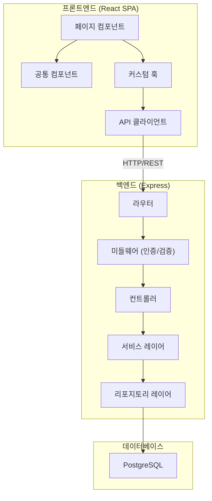
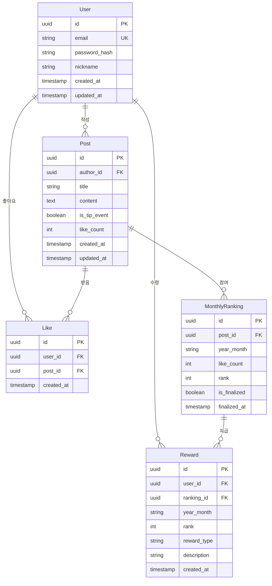

# 설계 문서: 독박육아 커뮤니티

## 개요 (Overview)

독박육아 커뮤니티는 혼자 육아를 담당하는 부모들을 위한 반응형 웹 애플리케이션이다. React 기반 SPA(Single Page Application)로 구현하며, 백엔드는 Node.js + Express로 REST API를 제공한다. 데이터 저장소는 PostgreSQL을 사용하고, 인증은 JWT 기반 세션 관리를 적용한다.

주요 기능은 사용자 인증, 대시보드, 게시판 CRUD, 월별 꿀팁 랭킹 시스템, 반응형 레이아웃으로 구성된다.

### 기술 스택

- **프론트엔드**: React 18, TypeScript, React Router, Axios, CSS Modules
- **백엔드**: Node.js, Express, TypeScript
- **데이터베이스**: PostgreSQL
- **인증**: JWT (Access Token + Refresh Token)
- **테스트**: Vitest, fast-check (property-based testing)
- **빌드**: Vite

### 설계 원칙

- 프론트엔드와 백엔드의 명확한 분리 (REST API 기반 통신)
- 컴포넌트 기반 UI 설계로 재사용성 확보
- 비즈니스 로직은 서비스 레이어에 집중하여 테스트 용이성 확보
- 반응형 디자인은 CSS 미디어 쿼리와 모바일 퍼스트 접근법 적용

## 아키텍처 (Architecture)



### 레이어 구조

1. **프론트엔드**: 페이지 → 컴포넌트 → 커스텀 훅 → API 클라이언트
2. **백엔드**: 라우터 → 미들웨어 → 컨트롤러 → 서비스 → 리포지토리
3. **데이터베이스**: PostgreSQL

서비스 레이어에 비즈니스 로직을 집중시켜 컨트롤러는 요청/응답 처리만 담당하고, 리포지토리는 데이터 접근만 담당한다. 이 구조를 통해 서비스 레이어의 순수 로직을 독립적으로 테스트할 수 있다.


## 컴포넌트 및 인터페이스 (Components and Interfaces)

### 프론트엔드 컴포넌트

#### 페이지 컴포넌트

| 컴포넌트 | 경로 | 설명 |
|---------|------|------|
| `LoginPage` | `/login` | 로그인 폼 |
| `RegisterPage` | `/register` | 회원가입 폼 |
| `DashboardPage` | `/dashboard` | 대시보드 메인 화면 |
| `PostListPage` | `/posts` | 게시글 목록 (페이지네이션, 검색) |
| `PostDetailPage` | `/posts/:id` | 게시글 상세 |
| `PostCreatePage` | `/posts/new` | 게시글 작성 |
| `PostEditPage` | `/posts/:id/edit` | 게시글 수정 |
| `RankingPage` | `/ranking` | 이번 달 꿀팁 랭킹 |
| `RankingArchivePage` | `/ranking/archive/:yearMonth` | 과거 랭킹 아카이브 |
| `MyPage` | `/mypage` | 리워드 내역 조회 |

#### 공통 컴포넌트

- `Header`: 내비게이션 바 (반응형 햄버거 메뉴 포함)
- `PostCard`: 게시글 요약 카드
- `LikeButton`: 좋아요 토글 버튼
- `Pagination`: 페이지네이션 컨트롤
- `SearchBar`: 검색 입력 필드
- `ConfirmDialog`: 삭제 확인 대화상자
- `ResponsiveLayout`: 반응형 레이아웃 래퍼

### 백엔드 API 인터페이스

#### 인증 API

```
POST   /api/auth/register    - 회원가입
POST   /api/auth/login       - 로그인
POST   /api/auth/logout      - 로그아웃
POST   /api/auth/refresh     - 토큰 갱신
```

#### 게시판 API

```
GET    /api/posts             - 게시글 목록 (쿼리: page, search)
POST   /api/posts             - 게시글 작성
GET    /api/posts/:id         - 게시글 상세
PUT    /api/posts/:id         - 게시글 수정
DELETE /api/posts/:id         - 게시글 삭제
POST   /api/posts/:id/like    - 좋아요 토글
```

#### 랭킹 API

```
GET    /api/ranking/current           - 이번 달 랭킹
GET    /api/ranking/archive/:yearMonth - 과거 랭킹 조회
GET    /api/ranking/my                - 내 랭킹 정보
```

#### 리워드 API

```
GET    /api/rewards/my        - 내 리워드 내역
```

#### 대시보드 API

```
GET    /api/dashboard         - 대시보드 데이터 (최근 게시글, 랭킹 요약, 내 순위)
```

### 미들웨어

- `authMiddleware`: JWT 토큰 검증, 만료 시 401 응답
- `validationMiddleware`: 요청 본문 유효성 검사
- `ownershipMiddleware`: 게시글 소유자 확인 (수정/삭제 시)


## 데이터 모델 (Data Models)

### 엔티티 관계도



### 테이블 상세

#### User

| 필드 | 타입 | 제약조건 | 설명 |
|------|------|---------|------|
| id | UUID | PK | 사용자 고유 ID |
| email | VARCHAR(255) | UNIQUE, NOT NULL | 이메일 |
| password_hash | VARCHAR(255) | NOT NULL | bcrypt 해시된 비밀번호 |
| nickname | VARCHAR(50) | NOT NULL | 닉네임 |
| created_at | TIMESTAMP | NOT NULL, DEFAULT NOW() | 가입일시 |
| updated_at | TIMESTAMP | NOT NULL, DEFAULT NOW() | 수정일시 |

#### Post

| 필드 | 타입 | 제약조건 | 설명 |
|------|------|---------|------|
| id | UUID | PK | 게시글 고유 ID |
| author_id | UUID | FK(User), NOT NULL | 작성자 ID |
| title | VARCHAR(200) | NOT NULL | 제목 |
| content | TEXT | NOT NULL | 본문 |
| is_tip_event | BOOLEAN | NOT NULL, DEFAULT FALSE | 꿀팁 이벤트 참여 여부 |
| like_count | INTEGER | NOT NULL, DEFAULT 0 | 좋아요 수 (비정규화) |
| created_at | TIMESTAMP | NOT NULL, DEFAULT NOW() | 작성일시 |
| updated_at | TIMESTAMP | NOT NULL, DEFAULT NOW() | 수정일시 |

#### Like

| 필드 | 타입 | 제약조건 | 설명 |
|------|------|---------|------|
| id | UUID | PK | 좋아요 고유 ID |
| user_id | UUID | FK(User), NOT NULL | 사용자 ID |
| post_id | UUID | FK(Post), NOT NULL | 게시글 ID |
| created_at | TIMESTAMP | NOT NULL, DEFAULT NOW() | 좋아요 일시 |

- UNIQUE 제약: (user_id, post_id) — 사용자당 게시글 하나에 좋아요 1회

#### MonthlyRanking

| 필드 | 타입 | 제약조건 | 설명 |
|------|------|---------|------|
| id | UUID | PK | 랭킹 고유 ID |
| post_id | UUID | FK(Post), NOT NULL | 게시글 ID |
| year_month | VARCHAR(7) | NOT NULL | 대상 월 (YYYY-MM) |
| like_count | INTEGER | NOT NULL, DEFAULT 0 | 확정 시점 좋아요 수 |
| rank | INTEGER | NULL | 확정된 순위 |
| is_finalized | BOOLEAN | NOT NULL, DEFAULT FALSE | 확정 여부 |
| finalized_at | TIMESTAMP | NULL | 확정 일시 |

#### Reward

| 필드 | 타입 | 제약조건 | 설명 |
|------|------|---------|------|
| id | UUID | PK | 리워드 고유 ID |
| user_id | UUID | FK(User), NOT NULL | 수령 사용자 ID |
| ranking_id | UUID | FK(MonthlyRanking), NOT NULL | 관련 랭킹 ID |
| year_month | VARCHAR(7) | NOT NULL | 대상 월 |
| rank | INTEGER | NOT NULL | 수상 순위 (1~3) |
| reward_type | VARCHAR(50) | NOT NULL | 리워드 유형 |
| description | VARCHAR(255) | NOT NULL | 리워드 설명 |
| created_at | TIMESTAMP | NOT NULL, DEFAULT NOW() | 지급일시 |

### 설계 결정 사항

1. **like_count 비정규화**: Post 테이블에 like_count를 직접 저장하여 매번 Like 테이블을 집계하지 않도록 한다. 좋아요 토글 시 트랜잭션으로 Like 레코드와 Post.like_count를 동시에 갱신한다.
2. **MonthlyRanking 분리**: 월별 랭킹을 별도 테이블로 관리하여 과거 랭킹 아카이브를 효율적으로 조회한다. 진행 중인 랭킹은 Post 테이블의 like_count를 실시간 조회하고, 월말 확정 시 MonthlyRanking에 스냅샷을 저장한다.
3. **JWT 이중 토큰**: Access Token(15분)과 Refresh Token(7일)을 사용하여 보안과 사용자 경험을 균형 있게 유지한다.

